# Introducción + Instalación del sistema operativo

## ¿Qué es la Raspberry Pi?  
La **Raspberry Pi** es una computadora de placa única (*Single Board Computer - SBC*) del tamaño de una tarjeta de crédito, desarrollada en el Reino Unido por la **Raspberry Pi Foundation**. Su objetivo es promover la enseñanza de informática y electrónica accesible para todos, con un hardware económico y software de código abierto.  

### Características clave:  
- **Bajo costo**.  
- **Bajo consumo energético** (se alimenta mediante USB o fuente de poder dedicada).  
- **GPIO (General Purpose Input/Output)**: Pines para conectar sensores, LEDs y otros componentes electrónicos.  
- **Soporte para múltiples sistemas operativos** (Raspberry Pi OS, Ubuntu, etc.).  

---  

## Modelos más populares (2024)  
| Modelo               | RAM  | CPU               | Puertos destacados                     | Uso recomendado                     |  
|----------------------|------|-------------------|----------------------------------------|-------------------------------------|  
| **Raspberry Pi 5**   | 4-8GB| 2.4GHz quad-core  | 2x HDMI, USB 3.0, Gigabit Ethernet     | Proyectos avanzados, servidores    |  
| **Raspberry Pi 4B**  | 1-8GB| 1.5GHz quad-core  | 2x HDMI, USB-C, Gigabit Ethernet       | Multimedia, programación           |  
| **Raspberry Pi Zero 2 W** | 512MB | 1GHz quad-core | Mini HDMI, Micro-USB                   | IoT, proyectos compactos           |  
| **Raspberry Pi Pico**| -    | Microcontrolador RP2040 | GPIO, USB 1.1                  | Electrónica básica, robótica       |  

---  

## Aplicaciones comunes  
1. **Educación**:  
   - Enseñanza de programación (Python, Scratch).  
   - Talleres de robótica y electrónica.  

2. **Hogar y oficina**:  
   - Servidor de archivos (*NAS*).  
   - Centro multimedia (*Kodi, RetroPie*).  

3. **IoT y automatización**:  
   - Control de dispositivos inteligentes (luces, sensores).  
   - Estaciones meteorológicas.  

4. **Prototipo industrial**:  
   - Pruebas de conceptos en electrónica.  

---  

### ¿Por qué aprender Raspberry Pi?  
- **Flexibilidad**: Combina software y hardware en un solo dispositivo.  
- **Comunidad activa**: Miles de tutoriales y proyectos compartidos.  
- **Puerta de entrada** a carreras como IoT, ciberseguridad o desarrollo embebido.  

> 💡 *"La Raspberry Pi democratiza la tecnología: cualquiera puede crear soluciones innovadoras con pocos recursos."*  

# Componentes y accesorios de la Raspberry Pi  

## Componentes básicos (incluidos en la placa)  
1. **CPU/GPU**: Procesador principal (ARM) + gráficos integrados (ej: Broadcom VideoCore).  
2. **RAM**: Memoria volátil (varía por modelo: desde 512MB en Pi Zero hasta 8GB en Pi 5).  
3. **GPIO (*General Purpose Input/Output*)**:  
   - Pines (40 en modelos recientes) para conectar sensores, LEDs, motores, etc.  
   - Protocolos soportados: I2C, SPI, UART.  
4. **Puertos**:  
   - **USB** (para teclado/ratón).  
   - **HDMI** (salida de video).  
   - **Ethernet** (en modelos no Zero).  
   - **Micro-USB/USB-C** (alimentación).  
5. **Ranura para tarjeta microSD**: Almacenamiento principal (sistema operativo y datos).  

---  

## Accesorios esenciales (no incluidos)  
| Accesorio               | Descripción                                                                 | Ejemplo de uso                     |  
|-------------------------|-----------------------------------------------------------------------------|------------------------------------|  
| **Fuente de poder**     | 5V/3A (USB-C o Micro-USB según modelo).                                     | Evitar reinicios por bajo voltaje. |  
| **Tarjeta microSD**     | Mínimo 8GB (clase 10 recomendada).                                          | Instalar el sistema operativo.     |  
| **Carcasa**             | Protector físico (plástico, aluminio).                                      | Evitar cortocircuitos.             |  
| **Teclado + Ratón**     | USB o Bluetooth.                                                            | Configuración inicial.             |  
| **Pantalla**            | Monitor con entrada HDMI o pantalla táctil compatible.                      | Interfaz gráfica.                  |  

---  

## Accesorios avanzados (para proyectos)  
- **Módulo de cámara**: Para fotografía, visión artificial (ej: reconocimiento facial).  
- **Pantalla táctil LCD**: 3.5" o 7" (conectada via GPIO o HDMI).  
- **HATs (*Hardware Attached on Top*)**:  
  - **Sense HAT**: Sensores de temperatura, humedad, giroscopio (usado en la ISS).  
  - **PoE HAT**: Alimentación via Ethernet (*Power over Ethernet*).  
- **Módulos WiFi/Bluetooth**: En modelos sin conectividad inalámbrica (ej: Pi Zero).  

---  

### Diagramas básicos:

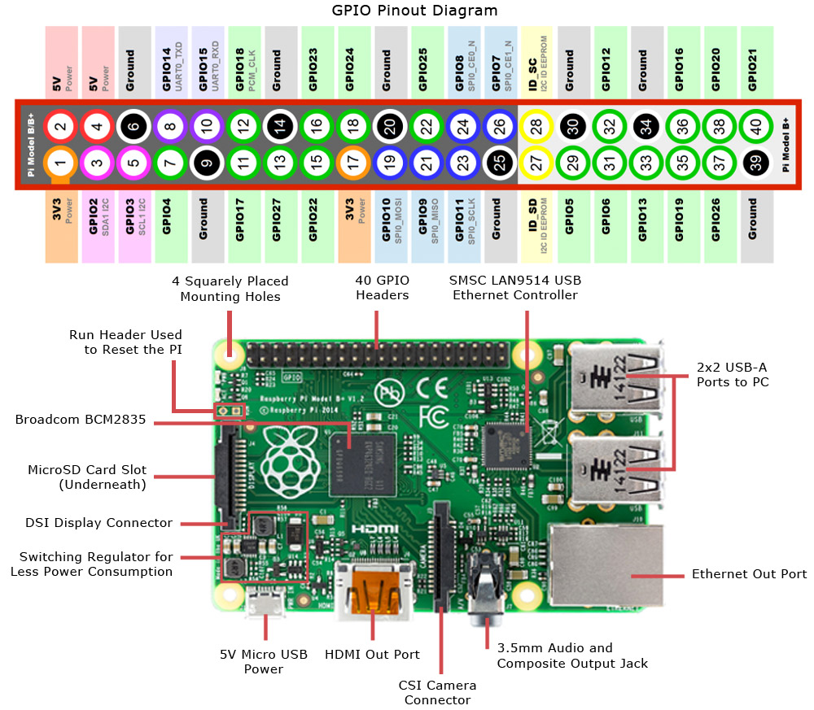;
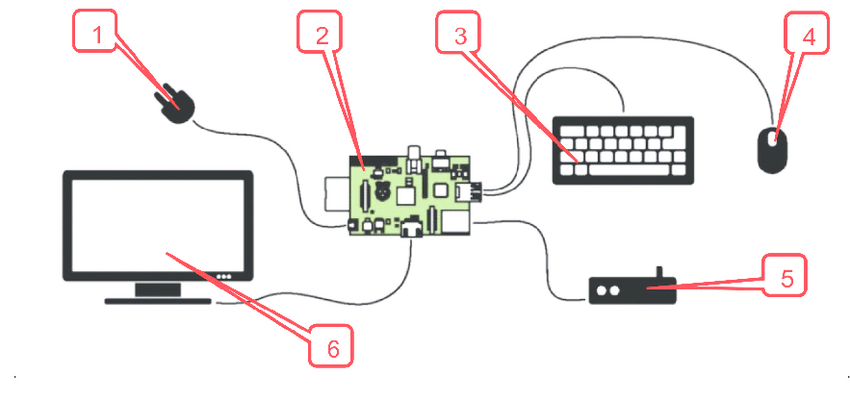

---

# Instalación de Raspberry Pi OS con Raspberry Pi Imager  

## Requisitos previos  
- **Hardware**:  
  - Raspberry Pi (cualquier versión de RAM).  
  - Tarjeta microSD (mínimo 16GB recomendado).  
  - Lector de tarjetas microSD.  
- **Software**:  
  - [Raspberry Pi Imager](https://www.raspberrypi.com/software/) instalado en tu computadora.  

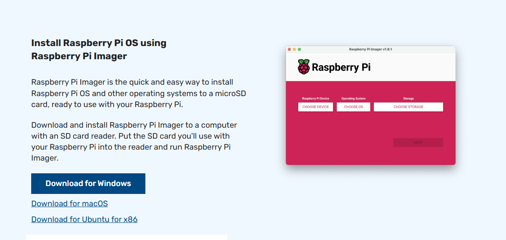
---  

## Paso a paso: Configuración con Pi Imager  

### 1. Descargar e iniciar Raspberry Pi Imager  
- Ejecuta el programa.  
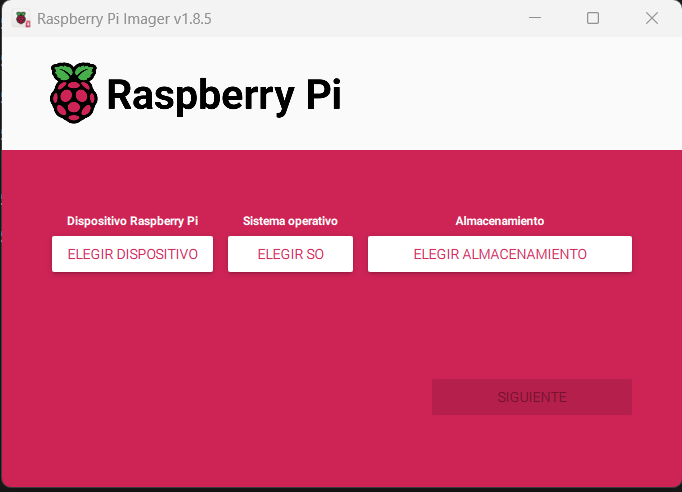


### 2. Seleccionar la version de la Raspberry a utilizar
- Haz clic en **"Choose Device"** → **"Raspberry Pi 4"** (o el modelo que tengas).
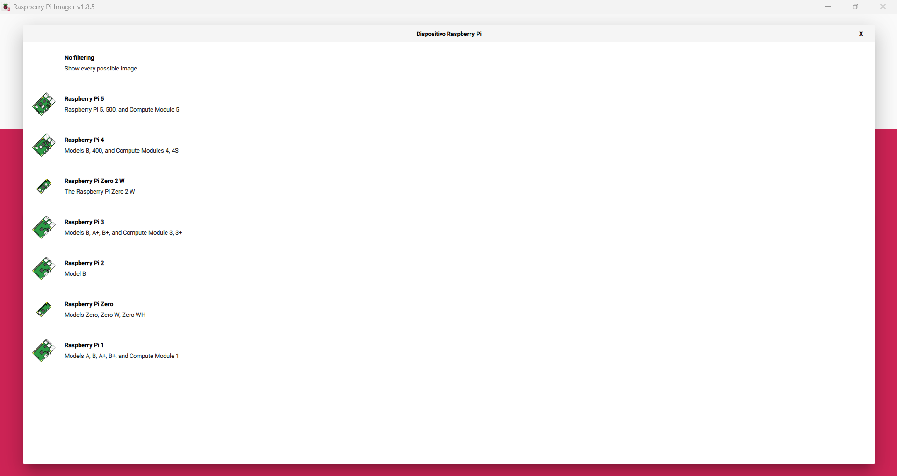

### 3. Seleccionar sistema operativo  
- Haz clic en **"Choose OS"** → **"Raspberry Pi OS (other)"** → **"Raspberry Pi OS (64-bit)"**.
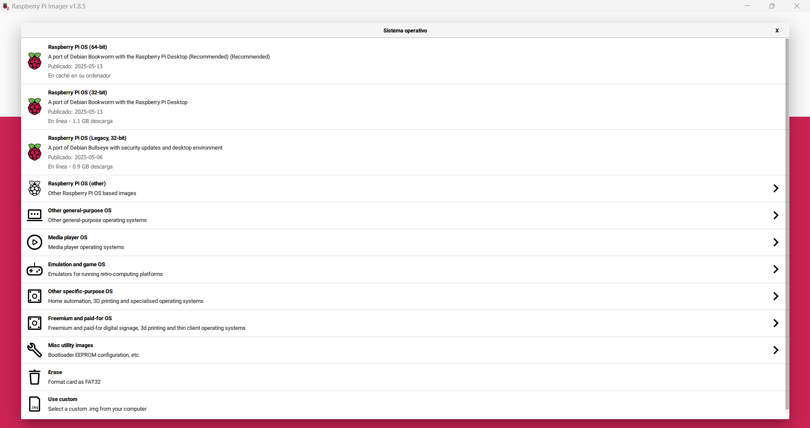

### 4. Elegir almacenamiento  
- Haz clic en **"Choose Storage"** → Selecciona tu tarjeta microSD.  
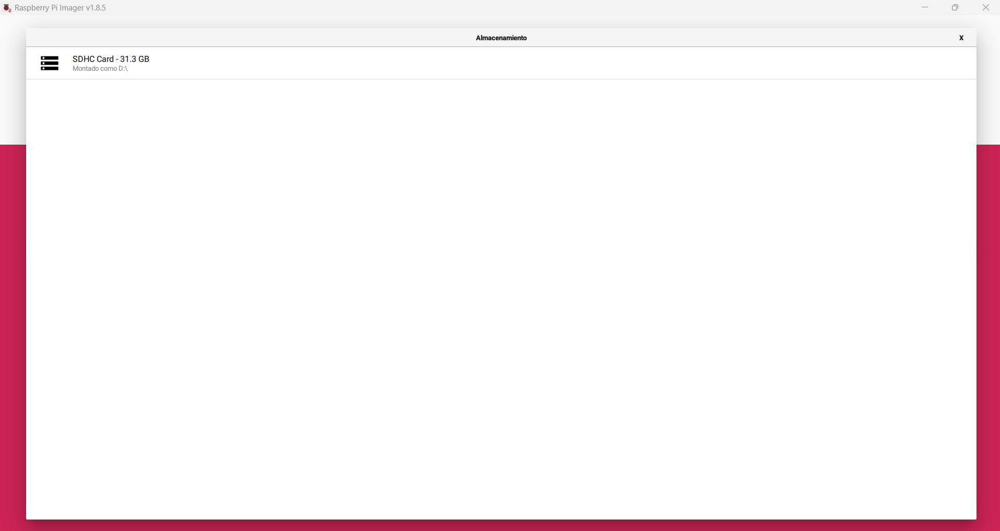

### 5. Configuración avanzada (¡clave para ahorrar tiempo!)  
- Al hacer clic en siguiente, nos preguntara si queremos editar la configuración por defecto, selecciona **"Editar Ajustes"**
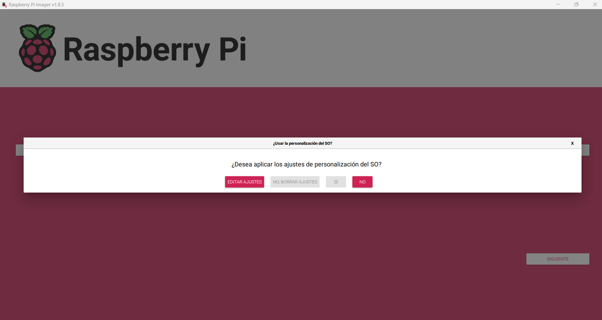

#### 🔹 **General**  
- **Hostname**: `raspberrypi` (o personaliza, ej: `ponchesPi`).  
- **Username & Password**:  
  - Usuario: `pi` (o el que elijan, ej: `alumno`).  
  - Contraseña: [Escriban una segura, ej: `Clase2024!`].  
- **Wireless LAN**:  
  - SSID: [Nombre de tu red WiFi].  
  - Contraseña: [Contraseña del WiFi].  
- **Locale Settings**:  
  - Timezone: `America/Guatemala` (ajusta según tu región).  
  - Keyboard Layout: `us` (o `es` para español).  
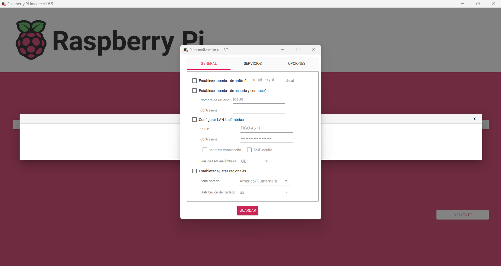

#### 🔹 **Services**  
- **Enable SSH**: Activado.  
  - Método: **"Use password authentication"** (para conexión inicial).   


### 5. Escribir la imagen en la tarjeta  
- Haz clic en **"Confirm"** → Confirmar con **"Yes"**.  
- Espera a que termine (puede tomar 5-15 minutos).  

---  

## Primer arranque y verificación  

1. **Insertar la microSD** en la Raspberry Pi 4 y conectar:  
   - Fuente de poder (USB-C).  
   - Monitor (vía HDMI).  
   - Teclado/ratón (opcional, ya que configuraste WiFi y SSH).  

2. **Inicio automático**:  
   - El sistema booteará y se conectará a tu red WiFi/LAN.  
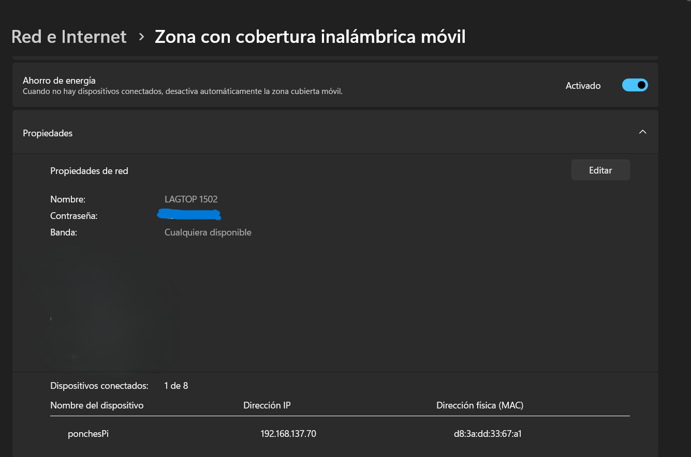

3. **Acceso remoto (SSH)**:  
   - Desde otra computadora en la misma red, usa:  
     ```bash  
     ssh pi@raspberrypi.local  
     ```  
     (o el hostname y usuario que se definió).  
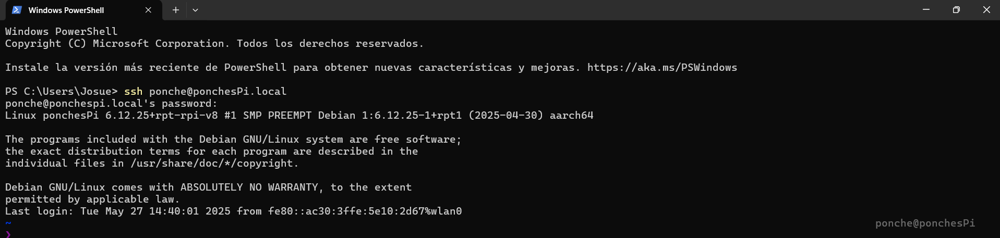

---  

## Solución de problemas comunes  
- **"Cannot connect via SSH"**: Verifica que la Raspberry Pi esté en la misma red que tu PC.  
- **"WiFi no funciona"**: Revisa la contraseña en Pi Imager o usa conexión por cable.  
- **"Tarjeta no bootea"**: Re-escribe la imagen o prueba otra microSD.  

>  **Consejo**: Después del primer login, ejecuta `sudo apt update && sudo apt upgrade` para actualizar el sistema.  
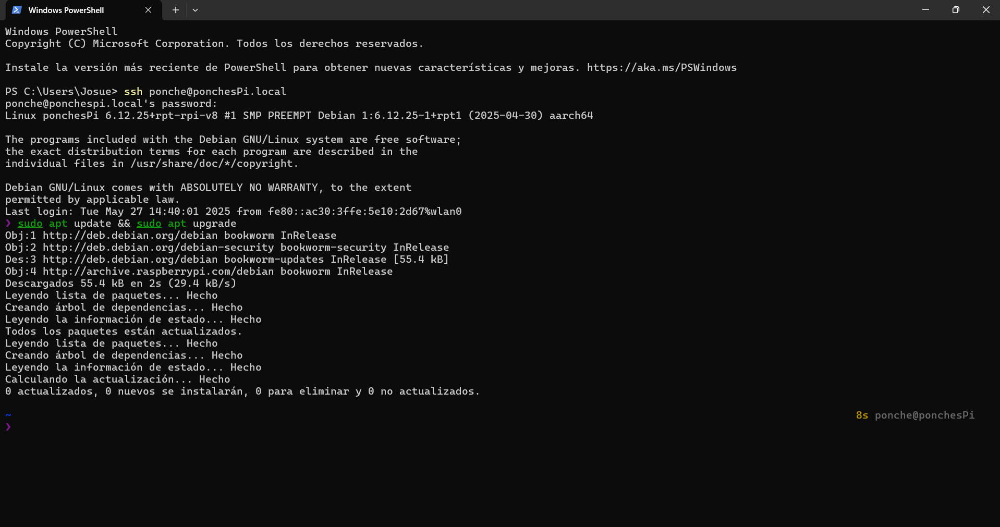
---  

# Raspberry Pi Connect: Acceso remoto y gestión de la Raspberry Pi (Version 4 en adelante)

Raspberry Pi Connect es una herramienta que permite gestionar y acceder a tu Raspberry Pi de forma remota, facilitando la administración de proyectos y la conexión a través de SSH.

Para poder usarlo hay que instalarlo en la Raspberry Pi y enlazarlo con tu cuenta de Raspberry Pi Connect. Para esto hay que visitar el sitio web [https://connect.raspberrypi.com](https://connect.raspberrypi.com) y seguir las instrucciones de instalación.

Documentación oficial: [Raspberry Pi Connect](https://www.raspberrypi.com/documentation/remote-access/raspberry-pi-connect.html).

## Instalación
1. **Accede a tu Raspberry Pi**: Conéctate a través de SSH.
2. **Ejecuta el siguiente comando** para instalar Raspberry Pi Connect:
   ```bash
    sudo apt update
    sudo apt full-upgrade
    sudo apt install rpi-connect 
   ```
3. **Inicia el servicio**:
   ```bash
    rpi-connect on
   ```
4. **Inicia sesión en tu cuenta de Raspberry Pi**
   ```bash
    rpi-connect signin
   ```
5. **Enlaza tu Raspberry Pi**: Sigue las instrucciones en pantalla para enlazar tu dispositivo con tu cuenta de Raspberry Pi Connect.
6. **Verifica la conexión**: Una vez enlazada, podrás ver tu Raspberry Pi en el panel de control de Raspberry Pi Connect.

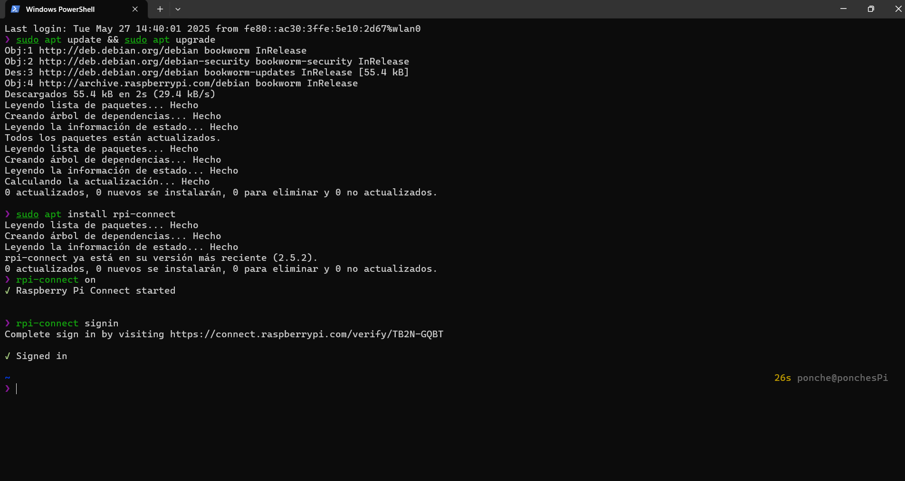

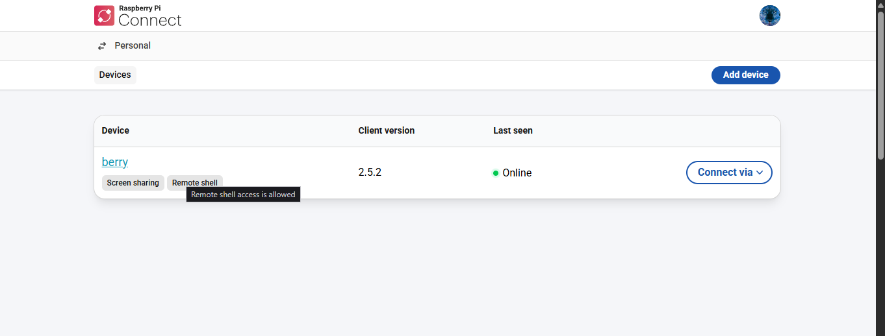

## Uso de Raspberry Pi Connect
Una vez que tu Raspberry Pi esté conectada, podrás:
- **Acceder a la terminal**: Ejecuta comandos directamente desde el navegador.
- **Compartir pantalla**: Visualiza la pantalla de tu Raspberry Pi en tiempo real.
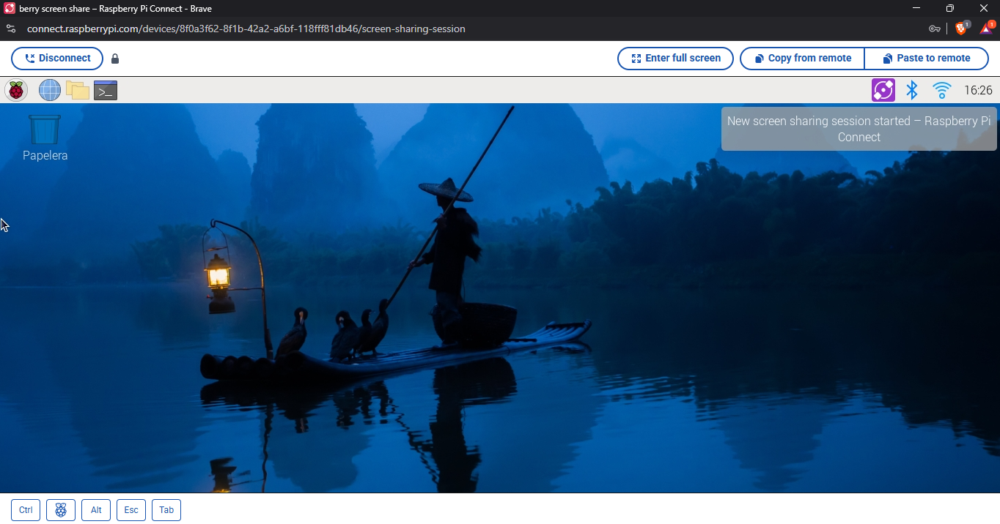
