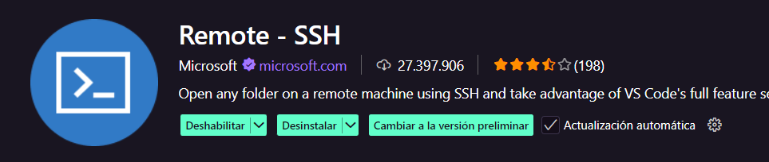
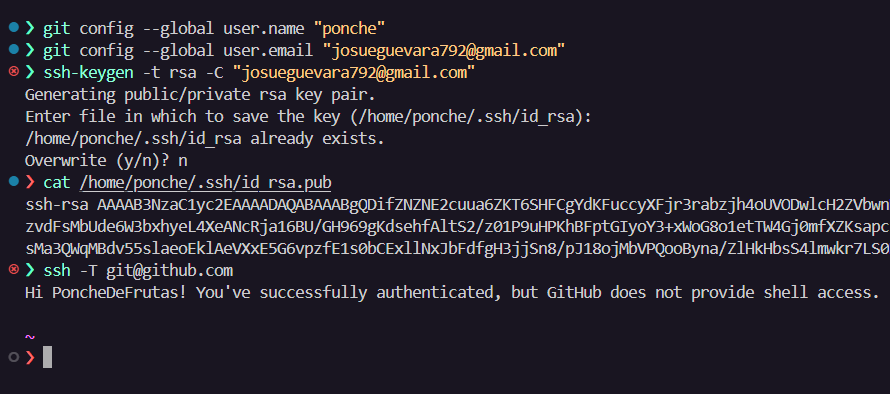

# Acceso Remoto y Fundamentos de Linux en Raspberry Pi

## Alcance y Objetivos
Este módulo cubre la interacción con sistemas Linux mediante terminal y gestión remota de dispositivos Raspberry Pi:

1. **Operaciones básicas en terminal Linux**
   - Navegación del sistema de archivos

2. **Acceso remoto mediante SSH**
   - Protocolo SSH y autenticación
   - Integración con VS Code
  
3. **Instalación de herramientas**
   - Gestión de paquetes con `apt`
   - Python, Git y gestores de dependencias

## Requisitos Previos
- Raspberry Pi con Raspberry Pi OS instalado
- Acceso SSH habilitado
- Conexión de red estable (LAN/WiFi)

## Contexto Técnico

### SSH (Secure Shell)
Protocolo criptográfico para operaciones remotas seguras (puerto TCP/22 por defecto).

### Linux Filesystem Hierarchy Standard
Especificación para ubicación de archivos en sistemas Unix-like.

### Gestión de Paquetes
Raspberry Pi OS utiliza `apt` (Advanced Package Tool) para manejo de software.

## Herramientas Involucradas

| Componente        | Descripción                                |
|-------------------|--------------------------------------------|
| `bash`           | Shell predeterminado                       |
| `openssh-server` | Implementación del protocolo SSH           |
| `git`            | Sistema de control de versiones            |
| `python3`        | Intérprete Python incluido                 |

# Terminal y Comandos Esenciales en Linux

## 1. Introducción al Terminal

### Conceptos Clave

* **Terminal**: Interfaz de línea de comandos (CLI) para interactuar con el sistema operativo
* **Shell**: Intérprete de comandos (Bash es el predeterminado en Raspberry Pi OS)
* **Prompt**: Indicador que muestra información básica (`usuario@host:directorio$`)

### Acceso al Terminal

* Directamente en Raspberry Pi con teclado/monitor
* Remotamente vía SSH: `ssh usuario@direccion_ip`

## 2. Sistema de Archivos

### Estructura Básica

```
/           # Raíz del sistema
├── bin     # Comandos esenciales
├── etc     # Configuraciones del sistema
├── home    # Directorios de usuarios
├── var     # Archivos variables (logs, etc.)
└── usr     # Aplicaciones y utilidades
```

### Comandos de Navegación

| Comando | Descripción               | Ejemplo          |
| ------- | ------------------------- | ---------------- |
| pwd     | Muestra directorio actual | `pwd`            |
| ls      | Lista archivos            | `ls -lha`        |
| cd      | Cambia directorio         | `cd /var/log`    |
| mkdir   | Crea directorio           | `mkdir proyecto` |
| rmdir   | Elimina directorio vacío  | `rmdir temporal` |

## 3. Manipulación de Archivos

### Operaciones Básicas

| Comando | Función             | Ejemplo                  |
| ------- | ------------------- | ------------------------ |
| cp      | Copiar archivos     | `cp origen.txt destino/` |
| mv      | Mover/renombrar     | `mv viejo.txt nuevo.txt` |
| rm      | Eliminar archivos   | `rm -r directorio/`      |
| touch   | Crear archivo vacío | `touch archivo.txt`      |
| cat     | Mostrar contenido   | `cat config.txt`         |
| nano    | Editor de texto     | `nano documento.txt`     |


## 4. Procesos y Sistema

### Gestión de Procesos

```bash
ps aux                 # Lista todos los procesos
top                    # Monitor interactivo
kill -9 PID            # Termina proceso forzadamente
htop                   # Alternativa mejorada a top
```

## 5. Gestión de Paquetes

### Comandos APT (Debian/Raspberry Pi OS)

```bash
sudo apt update        # Actualiza lista de paquetes
sudo apt upgrade       # Actualiza paquetes instalados
sudo apt install git   # Instala un paquete
sudo apt remove nano   # Elimina un paquete
```

## 9. Atajos de Teclado

| Atajo  | Función                       |
| ------ | ----------------------------- |
| Ctrl+C | Detener proceso actual        |
| Ctrl+Z | Pausar proceso                |
| Ctrl+D | Cerrar sesión                 |
| Ctrl+L | Limpiar pantalla              |
| Tab    | Autocompletar nombres         |
| Ctrl+R | Buscar en historial           |
| ↑ / ↓  | Navegar historial de comandos |


> **Nota:** Todos los comandos son sensibles a mayúsculas/minúsculas y generalmente requiere


# Conexión SSH a VS Code y Extensiones Recomendadas

## 1. Configuración de SSH en VS Code

### Requisitos previos

* VS Code instalado
* Raspberry Pi accesible en la red local
* SSH habilitado en la Raspberry Pi (ver Día 1)

### Pasos para conectar:

1. **Instalar la extensión Remote - SSH**:

   * Abrir VS Code
   * Ir a Extensiones (Ctrl+Shift+X)
   * Buscar "Remote - SSH" (Microsoft)
   * Instalar
    

2. **Configurar conexión**:

   * Abrir paleta de comandos (Ctrl+Shift+P)
   * Buscar "Remote-SSH: Add New SSH Host"
   * Ingresar: `ssh usuario@direccion_ip -A` (ej: `ssh pi@192.168.1.100`)
   * Seleccionar archivo config (\~/.ssh/config)

2. **Conectar**:

   * Paleta de comandos → "Remote-SSH: Connect to Host"
   * Seleccionar el host configurado
   * Ingresar contraseña cuando solicite

## 2. Extensiones Esenciales para Desarrollo

### Extensiones para instalar en VS Code (lado cliente):

| Extensión        | Descripción             | Enlace                                                                                      |
| ---------------- | ----------------------- | ------------------------------------------------------------------------------------------- |
| **Remote - SSH** | Conexión remota         | [Instalar](https://marketplace.visualstudio.com/items?itemName=ms-vscode-remote.remote-ssh) |
| **Python**       | Soporte para Python     | [Instalar](https://marketplace.visualstudio.com/items?itemName=ms-python.python)            |
| **Pylance**      | Autocompletado avanzado | [Instalar](https://marketplace.visualstudio.com/items?itemName=ms-python.vscode-pylance)    |
| **GitLens**      | Mejoras para Git        | [Instalar](https://marketplace.visualstudio.com/items?itemName=eamodio.gitlens)             |

### Extensiones para instalar en el lado remoto (Raspberry Pi):

**Al conectar por SSH**, VS Code sugerirá instalar extensiones en el remoto

## 3. Configurar clave ssh de github

- Primero hay que configurar el nombre de usuario y correo electrónico:

```bash
git config --global user.name "Tu Nombre"
git config --global user.email "Tu Email"
```
- Luego, generar una clave SSH si no se tiene:

```bash
ssh-keygen -t rsa -C "Tu Email"
```
- Copiar la clave pública al portapapeles:

```bash
cat ~/.ssh/id_rsa.pub | xclip -selection clipboard
```
- Agregar la clave SSH a GitHub:

  1. Ir a [GitHub Settings](https://github.com/settings/keys)
  2. Hacer clic en "New SSH key"
  3. Pegar la clave copiada y darle un título descriptivo
  4. Hacer clic en "Add SSH key"
  5. Probar la conexión:
```bash
# La primera vez que se conecta, puede pedir confirmación de la huella digital del servidor:
ssh -T git@github.com
# Hi User! You've successfully authenticated, but GitHub does not provide shell access.
```




## 4. Flujo de Trabajo con Git

### Inicializar repositorio:

```bash
git init
git remote add origin [URL_REPO]
```

### Usar GitLens para:

* Visualizar historial de cambios
* Comparar versiones
* Navegar por ramas

### Atajos útiles:

* Ctrl+Shift+G: Panel de Git
* Alt+G luego C: Hacer commit
* Alt+G luego P: Hacer push

## 5. Solución de Problemas Comunes

| Problema                   | Solución                                         |
| -------------------------- | ------------------------------------------------ |
| Conexión rechazada         | Verificar sshd en RPi: `sudo service ssh status` |
| Extensiones no se instalan | Verificar conexión estable                       |
| Autocompletado lento       | Desactivar extensiones no esenciales             |
| Permisos denegados         | Usar `chmod 600` en archivos clave SSH           |

> **Nota**: Para desarrollo en Python, se recomienda crear un entorno virtual (`python3 -m venv venv`) antes de instalar paquetes.

---

# Instalación de Herramientas Esenciales en Raspberry Pi

## 1. Gestión de Paquetes Básica

### Actualización del sistema

```bash
sudo apt update && sudo apt upgrade -y
```

### Instalación de herramientas básicas

```bash
sudo apt install -y build-essential libssl-dev libffi-dev python3-dev
```

## 2. Instalación y Configuración de Python

### Python 3 (Preinstalado en Raspberry Pi OS)

```bash
python3 --version  # Verificar versión
```

## 3. Gestión de Paquetes Python (pip)

### Instalación y actualización

```bash
sudo apt install -y python3-pip
python3 -m pip install --upgrade pip setuptools wheel
```

### Uso básico de pip

```bash
pip install nombre_paquete          # Instalar paquete
pip uninstall nombre_paquete       # Desinstalar
pip freeze > requirements.txt      # Generar lista de dependencias
pip install -r requirements.txt    # Instalar desde lista
```

## 4. Herramientas Complementarias

### Entornos virtuales

```bash
sudo apt install -y python3-venv
python3 -m venv mi_entorno       # Crear entorno
source mi_entorno/bin/activate   # Activar (Linux)
```

## 5. Verificación de Instalaciones

```bash
python3 --version
pip --version
git --version
```

## 6. Solución de Problemas Comunes

| Problema                       | Solución                                           |
| ------------------------------ | -------------------------------------------------- |
| Permisos denegados al usar pip | Usar `pip install --user` o `sudo -H`              |
| Error con paquetes de sistema  | No mezclar `apt` y `pip` para paquetes del sistema |
| Conflictos de versiones        | Usar entornos virtuales                            |
| Git pide credenciales          | Configurar SSH o usar credential helper            |

## 7. Recomendaciones de Seguridad

* No usar `root` para instalaciones regulares
* Actualizar regularmente:

```bash
sudo apt update && sudo apt upgrade
python3 -m pip list --outdated
```

* Verificar firmas de paquetes antes de instalar
* Usar entornos virtuales para proyectos Python

> **Nota**: Después de instalar Docker o cambiar grupos de usuario, es necesario cerrar y volver a abrir la sesión SSH.

---