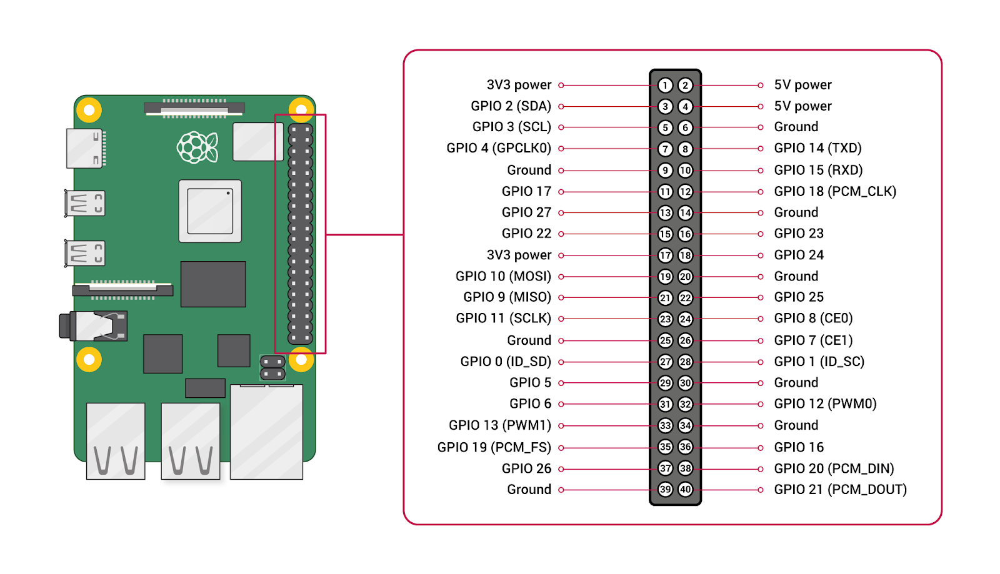

# GPIOs y Sensores - Introducción

## 1. Concepto de GPIO

### Definición

**GPIO** (General Purpose Input/Output) son pines programables que permiten:

- **Entrada**: Leer señales de sensores y dispositivos externos  
- **Salida**: Controlar actuadores como LEDs, relays y motores

### Características en Raspberry Pi

- **40 pines** (modelos recientes)  
- **Voltaje**: 3.3V (nunca 5V directamente)  
- **Corriente máxima**: 16mA por pin (50mA total)  
- **Protocolos soportados**: I2C, SPI, UART (además de GPIO básico)

---

## 2. Diagrama de Pines


# Uso de RPi.GPIO y gpiozero para control de GPIOs

## 1. RPi.GPIO (Enfoque tradicional)

### Instalación

```bash
pip install RPi.GPIO
```

### Configuración inicial

```python
import RPi.GPIO as GPIO
GPIO.setmode(GPIO.BOARD)     # Usar numeración BOARD (física)  
GPIO.setmode(GPIO.BCM)       # Usar numeración BCM (Broadcom)
GPIO.setwarnings(False)      # Desactivar advertencias
```


### Modos de operación

```python
# Configurar pin como salida
GPIO.setup(18, GPIO.OUT)

# Configurar pin como entrada con pull-up interno
GPIO.setup(17, GPIO.IN, pull_up_down=GPIO.PUD_UP)
```

### Control básico

```python
# Escribir valor digital
GPIO.output(18, GPIO.HIGH)  # Encender
GPIO.output(18, GPIO.LOW)   # Apagar

# Leer entrada digital
if GPIO.input(17) == GPIO.LOW:
    print("Botón presionado")
```

### Limpieza final

```python
GPIO.cleanup()  # Liberar recursos
```

---

## 2. gpiozero (Enfoque orientado a objetos)

### Ventajas principales

* Sintaxis más intuitiva
* Implementa patrones para componentes comunes
* No requiere `cleanup()` automático

### Componentes básicos

```python
from gpiozero import LED, Button

led = LED(18)          # Pin 18 como salida
button = Button(17)    # Pin 17 como entrada con pull-up
```

### Control simplificado

```python
led.on()          # Encender
led.off()         # Apagar
led.toggle()      # Cambiar estado
led.blink()       # Parpadear (background)

if button.is_pressed:
    print("Botón presionado")
```

### Eventos

```python
button.when_pressed = led.on
button.when_released = led.off
```

---

## 3. Comparación detallada

| Operación         | RPi.GPIO             | gpiozero                        |
| ----------------- | -------------------- | ------------------------------- |
| **Instalación**   | Requiere instalación | Preinstalado en Raspberry Pi OS |
| **Configuración** | Manual detallada     | Automática por componente       |
| **Sintaxis**      | Procedimental        | Orientada a objetos             |
| **PWM**           | Configuración manual | Integrado en objetos            |
| **Eventos**       | Usar polling o hilos | Callbacks nativos               |
| **Seguridad**     | Requiere `cleanup()` | Garbage collection automático   |
| **Documentación** | Más técnica          | Ejemplos prácticos              |

---

## 4. Ejemplo completo con ambas bibliotecas

### Con RPi.GPIO

```python
import RPi.GPIO as GPIO
import time

GPIO.setmode(GPIO.BCM)
GPIO.setup(18, GPIO.OUT)
GPIO.setup(17, GPIO.IN, pull_up_down=GPIO.PUD_UP)

try:
    while True:
        if GPIO.input(17) == GPIO.LOW:
            GPIO.output(18, GPIO.HIGH)
        else:
            GPIO.output(18, GPIO.LOW)
        time.sleep(0.1)
finally:
    GPIO.cleanup()
```

### Con gpiozero

```python
from gpiozero import LED, Button
from signal import pause

led = LED(18)
button = Button(17)

button.when_pressed = led.on
button.when_released = led.off

pause()  # Mantener el programa activo
```

---

## 5. Recomendaciones de uso

* **Para principiantes**: `gpiozero` (más sencillo y seguro)
* **Para proyectos avanzados**: `RPi.GPIO` (mayor control)
* **Para educación**: `gpiozero` (mejor abstracción)
* **Para tiempo real**: `RPi.GPIO` (menos overhead)

> **Nota importante**: Nunca mezclar ambas bibliotecas en el mismo programa para los mismos pines.

---

## 6. Recursos adicionales

* [Documentación gpiozero](https://gpiozero.readthedocs.io/)
---

# Lectura de Sensores Digitales DHT11/DHT22

## 1. Características de los Sensores

### Comparativa DHT11 vs DHT22

| Parámetro      | DHT11             | DHT22                |
| -------------- | ----------------- | -------------------- |
| **Rango Temp** | 0-50°C (±2°C)     | -40-80°C (±0.5°C)    |
| **Rango Hum**  | 20-80% (±5%)      | 0-100% (±2%)         |
| **Frecuencia** | 1Hz (1 lectura/s) | 0.5Hz (1 lectura/2s) |
| **Consumo**    | 0.5-2.5mA         | 1-1.5mA              |
| **Precio**     | Bajo              | Moderado             |

## 2. Conexión Física

### Diagrama de Cableado

```
VCC (3.3V) -> Pin 1 del sensor
DATA       -> GPIO4 (Pin 7)
NC         -> No conectar
GND        -> Tierra (GND)
```

> **Nota**: Todos los modelos DHT usan protocolo **1-Wire** simplificado.

## 3. Librerías Recomendadas

### Opción 1: Adafruit\_DHT (Para RPi.GPIO)

```bash
pip3 install adafruit-circuitpython-dht
sudo apt-get install libgpiod2
```

## 4. Código de Ejemplo con Adafruit\_DHT

```python
import time
import board
import adafruit_dht

dht = adafruit_dht.DHT11(board.D4)


while True:
    try:
        temperature_c = dht.temperature
        temperature_f = temperature_c * (9 / 5) + 32
        humidity = dht.humidity
        print(f"Temp: {temperature_c:.1f} C / {temperature_f:.1f} F, Humidity: {humidity:.1f}%")
    except RuntimeError as e:
        print(f"RuntimeError: {e.args[0]}")
    except Exception as e:
        dht.exit()
        raise e
    except KeyboardInterrupt:
        print("Exiting program")
        break
    time.sleep(2.0)  # Wait for 2 seconds before the next reading
```

### Ejemplo de Salida

```bash
Temp: 28.5 C / 83.3 F, Humidity: 63.0%
Temp: 28.5 C / 83.3 F, Humidity: 63.0%
Temp: 28.5 C / 83.3 F, Humidity: 63.0%
Temp: 28.5 C / 83.3 F, Humidity: 63.0%
Temp: 28.5 C / 83.3 F, Humidity: 63.0%
Temp: 28.5 C / 83.3 F, Humidity: 63.0%
```

## 5. Solución de Problemas Comunes

| Error/Síntoma      | Solución                                                             |
| ------------------ | -------------------------------------------------------------------- |
| Lecturas erráticas | Usar resistencia pull-up de 4.7KΩ, cable corto (<1m)                 |
| Valores None       | Verificar alimentación 3.3V y conexión a tierra                      |
| Fallo intermitente | Aumentar delay entre lecturas (DHT22 necesita ≥2s)                   |
| ImportError        | Instalar dependencias: `sudo apt install python3-dev python3-pigpio` |

## 6. Mejores Prácticas

* Filtrar lecturas: Implementar promedio móvil (ej: últimas 3 lecturas)
* Manejo de errores: Reintentar lectura ante fallos (máx 3 intentos)
* Aislamiento: Proteger sensor de condensación en ambientes húmedos


## 7. Recursos Adicionales
* [Documentación Adafruit DHT](https://learn.adafruit.com/dht)
* [Tutoriales de Raspberry Pi](https://www.raspberrypi.org/documentation/)