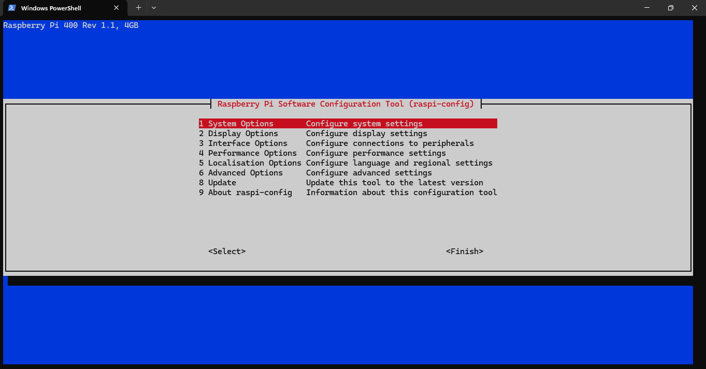
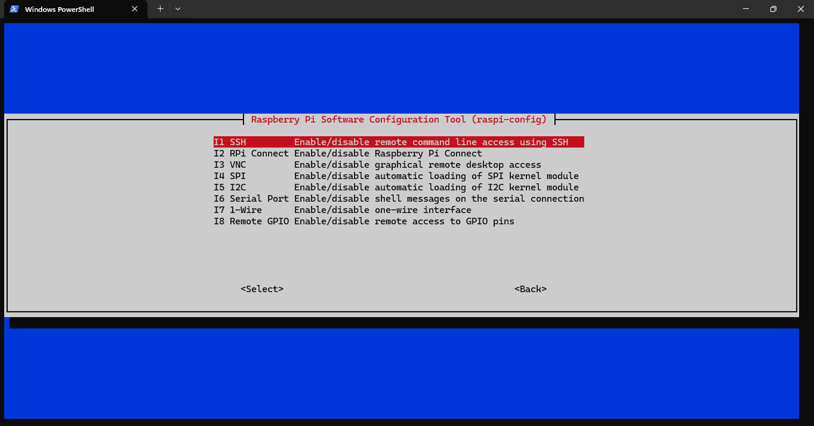
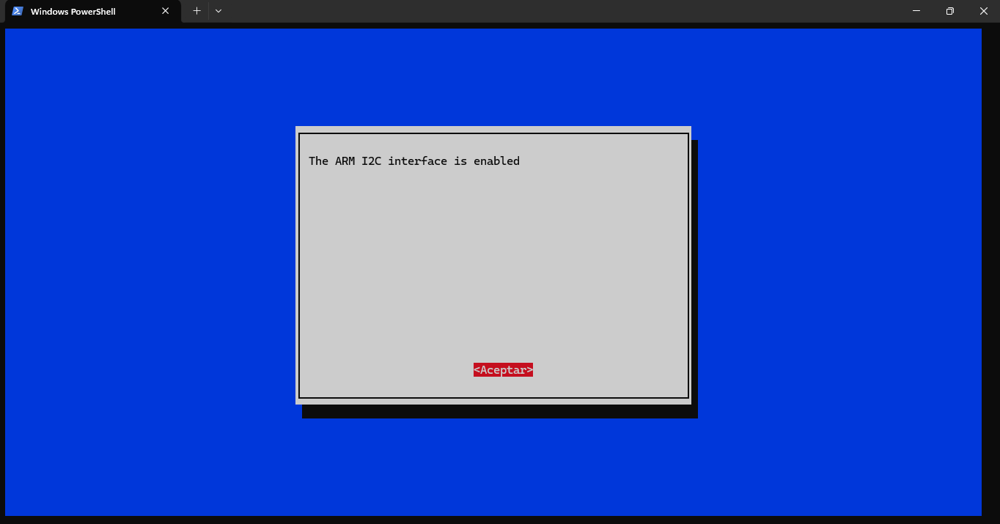
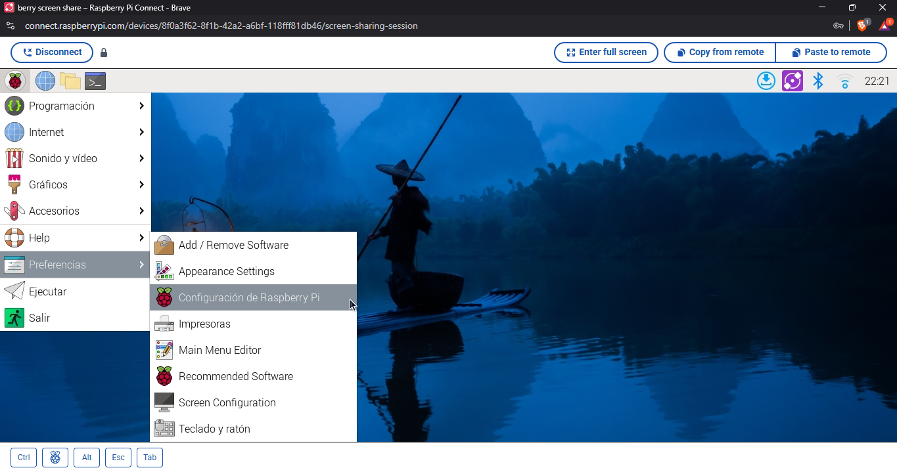
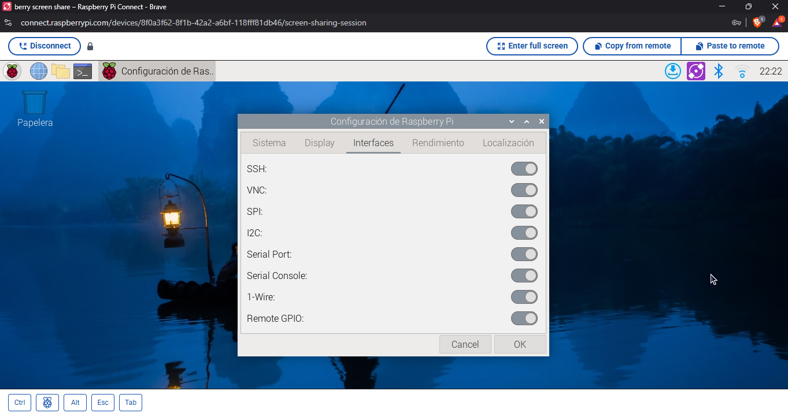

# Comunicación I2C y Automatización

## Objetivos
Este módulo cubre dos áreas fundamentales para proyectos embebidos avanzados:

1. **Protocolos de Comunicación**:
   - Interfaz con dispositivos periféricos mediante I2C
   - Configuración de hardware y software para módulos externos

2. **Automatización de Procesos**:
   - Ejecución programada de scripts
   - Gestión de servicios en segundo plano

## Relevancia en Sistemas Embebidos
Los protocolos I2C y SPI son esenciales para:
- Expandir funcionalidades mediante módulos especializados
- Minimizar el uso de pines GPIO
- Mantener bajo consumo energético
- Lograr alta confiabilidad en comunicaciones

## Flujo de Trabajo Propuesto
1. **Configuración de Interfaces**:
   - Habilitación de buses a nivel de sistema
   - Identificación de dispositivos conectados

2. **Interacción con Hardware**:
   - Conexión de pantallas LCD
   - Integración de módulos RTC (Reloj de Tiempo Real)

3. **Automatización**:
   - Programación de tareas recurrentes con cron
   - Creación de servicios persistentes con systemd
   - Gestión de logs y almacenamiento de datos

## Requisitos Previos
- Raspberry Pi con Raspberry Pi OS actualizado
- Acceso administrativo (sudo)
- Hardware compatible:
  - Módulos I2C/SPI (ej: SSD1306, DS3231)

## 1. Configuración Inicial de Interfaces

### Habilitar buses en Raspberry Pi

```bash
sudo raspi-config
# Seleccionar: 3 Interface Options → I2C → Enable
# Repetir para SPI
sudo reboot
```





### Otra alternativa para habilitar I2C/SPI
Por medio del apartado de configuración de Raspberry Pi OS:
Entrando a Preferences → Raspberry Pi Configuration → Interfaces, activar I2C y SPI.




> Luego de esto se tendrá que reiniciar el sistema para que los cambios surtan efecto.

### Verificar dispositivos detectados (I2C)

```bash
sudo apt install i2c-tools

i2cdetect -y 1  # Para Raspberry Pi modelos recientes

# en dado cause algún tipo de error, probar con:
/usr/sbin/i2cdetect -y 1

# Para dejarlo como solución permanente, agregar al bashrc del usuario actual:
export PATH="/usr/sbin:$PATH"

```

### Verificar dispositivos detectados (SPI)

```bash
❯ i2cdetect -y 1
     0  1  2  3  4  5  6  7  8  9  a  b  c  d  e  f
00:                         -- -- -- -- -- -- -- -- 
10: -- -- -- -- -- -- -- -- -- -- -- -- -- -- -- -- 
20: -- -- -- -- -- -- -- 27 -- -- -- -- -- -- -- -- 
30: -- -- -- -- -- -- -- -- -- -- -- -- -- -- -- -- 
40: -- -- -- -- -- -- -- -- -- -- -- -- -- -- -- -- 
50: -- -- -- -- -- -- -- -- -- -- -- -- -- -- -- -- 
60: -- -- -- -- -- -- -- -- -- -- -- -- -- -- -- -- 
70: -- -- -- -- -- -- -- --       

```


## 2. Conexión de Pantalla LCD 16x2 (I2C)

### Características Técnicas

* Controlador: PCF8574 (I2C)
* Dirección I2C: 0x27 (común)
* Voltaje: 5V (usar convertidor lógico 3.3V-5V)

### Diagrama de Conexión

```
LCD I2C       Raspberry Pi
-----------------------------
VCC      →     5V
GND      →     GND
SDA      →     GPIO2 (SDA1)
SCL      →     GPIO3 (SCL1)
```

### Instalación de Librería

```bash
pip install rpi-lcd
pip install adafruit-circuitpython-bmp280
```

### Código Básico

```python
from rpi_lcd import LCD
from time import sleep

lcd = LCD()

lcd.text('Hello World!', 1)
lcd.text('Raspberry Pi', 2)

sleep(5)
lcd.clear()
```

## 3. Conexión de Sensor BMP280 (I2C/SPI)

### Configuración por I2C

#### Cableado

```
BMP280       Raspberry Pi
-----------------------------
VCC      →     3.3V
GND      →     GND
SCK      →     GPIO3 (SCL1)
SDI      →     GPIO2 (SDA1)
```

### Código de Lectura

```python
import board
import adafruit_bmp280

i2c = board.I2C()
sensor = adafruit_bmp280.Adafruit_BMP280_I2C(i2c, address=0x76)

print(f"Temp: {sensor.temperature:.1f}°C")
print(f"Presión: {sensor.pressure:.1f}hPa")
```

## 4. Solución de Problemas Comunes

### LCD no muestra información

* Verificar dirección I2C con `i2cdetect -y 1`
* Ajustar contraste con potenciómetro del módulo I2C
* Confirmar voltaje correcto (5V para LCD)

### BMP280 no detectado

```bash
# Verificar conexión
i2cdetect -y 1
# Si no aparece, probar direcciones alternativas (0x76 y 0x77)
```

## 5. Diagrama de Conexión Combinado

```
Raspberry Pi   LCD I2C   BMP280 (I2C)
-------------------------------------
3.3V           -         VCC
5V             VCC       -
GND            GND       GND
GPIO2 (SDA)    SDA       SDA
GPIO3 (SCL)    SCL       SCL
```

## 6. Recomendaciones

### Para I2C:

* Usar cables cortos (<30cm)
* Añadir resistencias pull-up (4.7kΩ) si hay problemas
