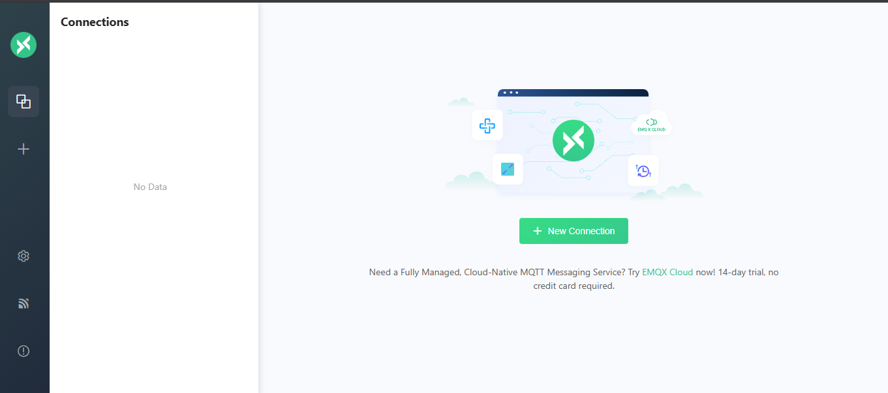
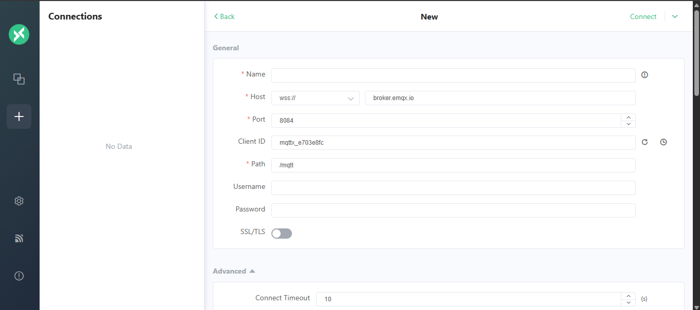
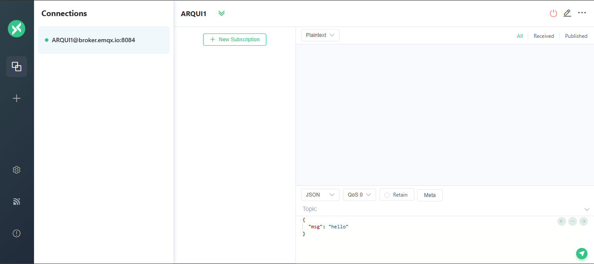
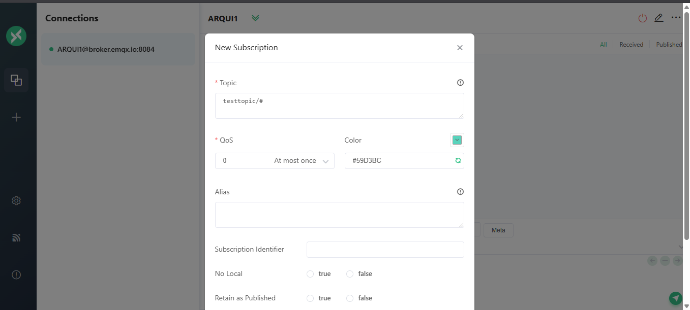
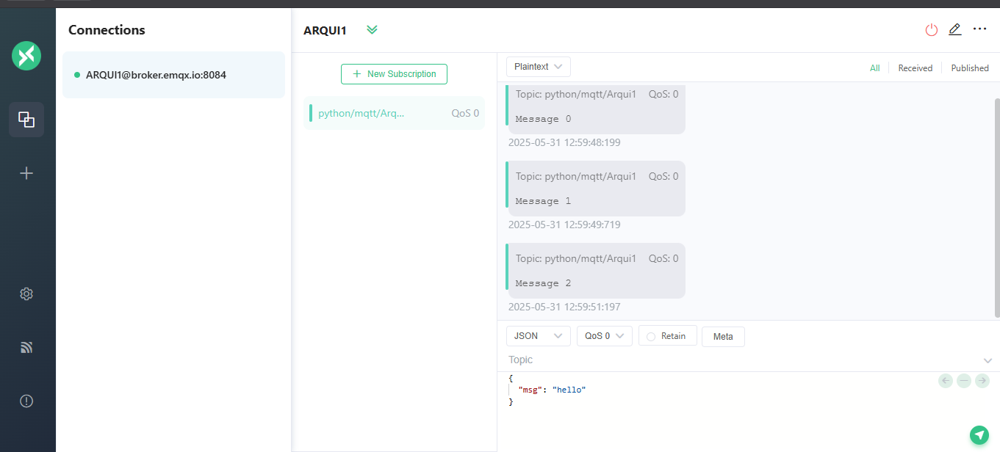

# Fundamentos de MQTT y Uso de MQTTX

## 1. Introducción a MQTT

### Concepto Clave

**MQTT** (Message Queuing Telemetry Transport) es un protocolo ligero de mensajería basado en el modelo **publish/subscribe**. Diseñado especialmente para:

* **Bajo consumo de ancho de banda y energía**
* **Alta eficiencia en redes inestables o limitadas**
* **Escalabilidad en dispositivos embebidos e IoT**

### Comparación MQTT vs HTTP

| Característica | MQTT                    | HTTP                       |
| -------------- | ----------------------- | -------------------------- |
| Modelo         | Publish/Subscribe       | Cliente/Servidor           |
| Conexión       | Persistente (TCP)       | Transitoria (stateless)    |
| Overhead       | Mínimo (2 bytes)        | Alto (cabeceras complejas) |
| Latencia       | Muy baja                | Media/alta                 |
| Uso típico     | IoT, domótica, sensores | Web, REST APIs             |

## 2. Arquitectura MQTT

### Componentes Principales

1. **Broker**: Servidor central que enruta y distribuye mensajes. Ej: **Mosquitto**
2. **Publisher**: Cliente que envía mensajes sobre un *topic* (ej: sensor de temperatura)
3. **Subscriber**: Cliente que recibe mensajes desde el *topic* suscrito (ej: app de monitoreo)

### Flujo de Mensajes

```
[ Publisher ] --PUBLISH--> [ Broker ] --FORWARD--> [ Subscriber ]
 (topic: "sensor/temp")                      (mismo topic)
```

## 3. Instalación de The Paho MQTT Client (Raspberry Pi)

``` bash
sudo apt update
sudo apt install python3-pip
pip3 install paho-mqtt
```

## 4. Uso de MQTT
### Configuración de un Broker MQTT
Se necesita un broker para enviar y recibir mensajes. Uno recomendado es EMQX o MQTTX. Puedes instalarlo localmente o usar un servicio en la nube. Estos sistemas conectan millones de dispositivos IoT y permiten la comunicación entre ellos.

Para fines de prueba, puedes usar un broker público como `[free public MQTT broker](https://www.emqx.com/en/mqtt/public-mqtt5-broker)

- **Broker Público**: `broker.emqx.io`
- **Puerto**: `1883` (sin TLS) o `8883` (con TLS)
- **WebSocket**: `8083` (sin TLS) o `8084` (con TLS)
- **SSL/TLS Port**: `8883`

### Diferencia entre con y sin TLS
El uso de TLS (Transport Layer Security) proporciona una capa adicional de seguridad cifrando los datos transmitidos entre el cliente y el broker. Esto es especialmente importante en aplicaciones críticas o donde la privacidad es esencial. Sin TLS, los datos se envían en texto claro, lo que puede ser interceptado fácilmente por terceros. En particular, en entornos IoT, donde los dispositivos pueden ser vulnerables, es recomendable usar TLS para proteger la comunicación.

### Importación de la librería Paho MQTT en Python
```python
from paho.mqtt import client as mqtt_client
```

### Conexión al Broker MQTT
```python
broker = 'broker.emqx.io'
port = 1883
topic = "test/topic/arqui1"
client_id = f'python-mqtt-{random.randint(0, 1000)}'
#username = 'emqx'
#password = 'public'
```

Lo siguiente por hacer es escribir la función de **callback** que se ejecutará al conectar al broker y suscribirse al topic.
```python
def connect_mqtt():
    def on_connect(client, userdata, flags, rc):
        # Para paho-mqtt 2.0.0 necesitas añadir los parámetros
        # def on_connect(client, userdata, flags, rc, properties):
        if rc == 0:
            print("Conectado al broker MQTT")
        else:
            print(f"Error al conectar, código de retorno: {rc}")
    
    client = mqtt_client.Client(client_id)

    client.on_connect = on_connect
    client.connect(broker, port)
    return client
```

### Auto Reconexión al Broker MQTT
la reconexión automática es una característica importante para mantener la conexión estable, especialmente en redes inestables. Puedes configurar el cliente MQTT para que intente reconectarse automáticamente si la conexión se pierde.

```python
FIRST_RECONNECT_DELAY = 1  # segundos
RECONNECT_RATE = 2  # segundos
MAX_RECONNECT_COUNT = 5  # máximo número de intentos
MAX_RECONNECT_DELAY = 30  # máximo tiempo de espera entre reconexiones

def on_disconnect(client, userdata, rc):
    logging.info("Desconectado del broker MQTT")
    reconnect_count, reconnect_delay = 0, FIRST_RECONNECT_DELAY
    while reconnect_count < MAX_RECONNECT_COUNT:
        try:
            logging.info(f"Intentando reconectar en {reconnect_delay} segundos...")
            time.sleep(reconnect_delay)
            client.reconnect()
            
            try:
                client.reconnect()
                logging.info("Reconectado al broker MQTT")
                return
            except Exception as e:
                logging.error(f"Error al reconectar: {e}")
            
            reconnect_delay *= RECONNECT_RATE
            reconnect_delay = min(reconnect_delay, MAX_RECONNECT_DELAY)
            reconnect_count += 1
        logging.error(f"Intento {reconnect_count} fallido")
```

para su definición debes añadir la función de desconexión al cliente MQTT:
```python
client.on_disconnect = on_disconnect
```

### Publicación de Mensajes
Para publicar mensajes en un topic específico, puedes usar el método `publish` del cliente MQTT.

```python
def publish(client):
    msg_count = 1
    while True:
        time.sleep(1)  # Espera 1 segundo entre mensajes
        msg = f"Mensaje {msg_count}"
        result = client.publish(topic, msg)
        
        status = result[0]
        if status == 0:
            print(f"Mensaje enviado: {msg}")
        else:
            print(f"Error al enviar mensaje: {msg}")
        
        msg_count += 1
        if msg_count > 10:  # Limitar a 10 mensajes
            break
```

### Suscripción a Mensajes
Para recibir mensajes de un topic, debes suscribirte a él usando el método `subscribe` del cliente MQTT. También necesitas definir una función de callback que se ejecutará cada vez que se reciba un mensaje.

```python
def subscribe(client: mqtt_client):
    def on_message(client, userdata, msg):
        print(f"Mensaje recibido en {msg.topic}: {msg.payload.decode()}")
    
    client.subscribe(topic)
    client.on_message = on_message
```


### De configuración del Cliente MQTT
En el apartado principal aparecerá de la siguiente manera:


Lo siguiente sera darle al apartado para ccrear una nueva conexión:


Se coloca el nombre de la conexión a utilizar unicamente, el broker a utilizar y el puerto de conexión. En este caso se utilizara el broker público de EMQX y se le da a crear conexión:


Ahora se tiene que crear un topic para poder publicar y suscribirse a los mensajes. Para esto se le da al apartado de "Topics" y se crea un nuevo topic (Subscription):
En este caso se creara el topic "test/topic/arqui1" y se le da a crear:


Ahora se verifica que el código de Python funciona correctamente. Se ejecuta el código del ejemplo 01.
